<div align="center">



# RIMM
### Web Developer · Full-Stack Builder · UI/UX Explorer

<a href="https://github.com/rimmalfarezi"></a>
<a href="https://github.com/rimmalfarezi?tab=repositories"></a>
<a href="https://github.com/rimmalfarezi/rimmgambling"></a>

</div>

---

## `> whoami`

I'm **Rimm**, a developer who enjoys turning ideas into polished web experiences. I like working close to the product: architecture, interface systems, interaction design, game mechanics, and the messy engineering details in between.

```txt
╭─────────────────────────────────────────────╮
│  CURRENTLY                                  │
│  ├─ Building interactive web products       │
│  ├─ Designing dark / cyber UI systems       │
│  ├─ Exploring full-stack architecture       │
│  └─ Learning by shipping                    │
╰─────────────────────────────────────────────╯
```

## `> stack`

<div align="center">


</div>

## `> featured work`

<table>
<tr>
<td width="50%">

### 🎮 RIMMPAGE
Interactive gaming platform with a multi-game ecosystem, economy, social features, inventory, marketplace, and admin tooling.

**Next.js · React · TypeScript · Supabase**

</td>
<td width="50%">

### 🤖 Bots & Automation
Experimenting with messaging bots, automation workflows, APIs, and practical tooling.

**Node.js · JavaScript · APIs · Linux**

</td>
</tr>
<tr>
<td width="50%">

### ☕ Coffeshop
A lightweight café web concept focused on QR-driven menus and a clean browsing experience.

**Web UI · Responsive Design · Product Thinking**

</td>
<td width="50%">

### 🧪 Experiments
Small projects are where I test ideas fast, break things, and keep the useful parts.

**Prototypes · UI Experiments · Open Source**

</td>
</tr>
</table>

## `> github telemetry`

<div align="center">


<br/>


</div>

## `> contribution signal`

<div align="center">


</div>

## `> let's build`

I'm interested in **web products, UI systems, game interfaces, automation, and weird technical experiments**.

<div align="center">

<a href="https://github.com/rimmalfarezi"></a>
<a href="mailto:limmrajaiblis@gmail.com"></a>

<br/><br/>


</div>
